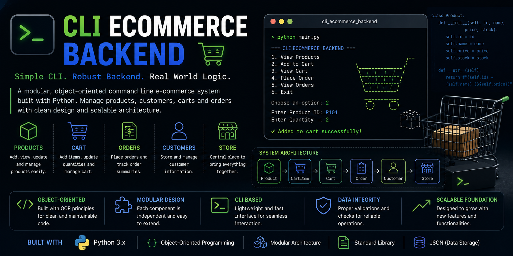
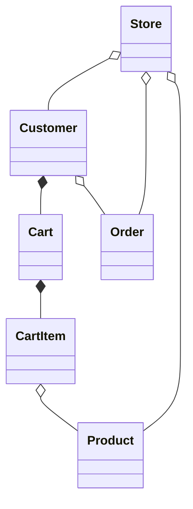
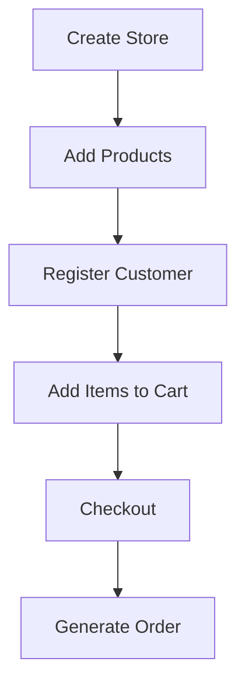

# 🛒 CLI E-Commerce Backend (Python)
<div align="center">



>  A Python-based command-line e-commerce backend built to master Object-Oriented Programming and software engineering fundamentals.


</div>

---

# 📌 Overview

This project is a command-line e-commerce backend developed entirely in Python as a practical way to learn software engineering concepts through a real-world application.

Rather than relying on frameworks, every feature is implemented from scratch with an emphasis on clean architecture, object-oriented design, and maintainable code.

---

# 🎯 Project Goals

* Build a realistic backend using Python
* Practice object-oriented programming through real-world scenarios
* Model relationships between classes
* Improve software design and debugging skills
* Build a portfolio-ready project while learning

---

# ✨ Features

## ✅ Implemented

* Product Management
* Shopping Cart
* Cart Items
* Customer Management
* Store Management
* Order Processing
* Inventory Management
* Checkout System
* Automatic Product IDs
* Data Validation

## 🚧 In Progress

* File Persistence

## 🔮 Planned

* Order History
* Product Search
* Discount Coupons
* Inventory Reports
* Unit Testing

---

# 📁 Project Structure

```text
cli-ecommerce-backend/
│
├──assets/
|   └──banner.png
|   
├── models/
│   ├── product.py
│   ├── cart.py
│   ├── cart_item.py
│   ├── customer.py
│   ├── order.py
│   └── store.py
│
├── utils/
│   └── file_handler.py
│
├── data/
│   ├── products.txt
│   ├── customers.txt
│   └── orders.txt
│
├── main.py
├── README.md
├── LICENSE
└── .gitignore
```

---

# 🏗️ Class Diagram



---

# 🔗 Object Relationships

| Relationship | Classes            |
| ------------ | ------------------ |
| Aggregation  | CartItem → Product |
| Aggregation  | Customer → Order   |
| Aggregation  | Store → Product    |
| Aggregation  | Store → Customer   |
| Aggregation  | Store → Order      |
| Composition  | Cart → CartItem    |
| Composition  | Customer → Cart    |

Additional relationships will be introduced as the project evolves.

---

# 🚀 Application Workflow



---

# 📸 Screenshots

## 🛍️ Product Catalog

```text
=========================================
              PRODUCT CATALOG
=========================================

[1] Product Details

----------------------------------------

Name: Laptop (ID: 1000)
Price: 50,000 Rs
Stock: 10 units available

----------------------------------------

[2] Product Details

----------------------------------------

Name: Smartphone (ID: 1001)
Price: 20,000 Rs
Stock: 20 units available

----------------------------------------

[3] Product Details

----------------------------------------

Name: Headphones (ID: 1002)
Price: 2,000 Rs
Stock: 50 units available

----------------------------------------

[4] Product Details

----------------------------------------

Name: Smartwatch (ID: 1003)
Price: 10,000 Rs
Stock: 15 units available

----------------------------------------
```

---

## 🛒 Shopping Cart

```text
=========================================
              CART OVERVIEW
=========================================

[1] Product Details

Name: Smartwatch
Price: 10,000 Rs
Quantity: 2
Net Price: 20,000 Rs

-----------------------------------------
Total Payable Amount: 20,000 Rs
-----------------------------------------
```

---

## 👤 Customer Details

```text
========================================
            CUSTOMER DETAILS
========================================

Name: Stephen Doe
Email: doe@example.com
ID: 1000
Total items in cart: 1

----------------------------------------
```

---

## 🧾 Order Invoice

```text
========================================
             ORDER INVOICE
========================================

----------------------------------------
             CUSTOMER INFO
----------------------------------------
Name   : Stephen Doe
Email  : doe@example.com
ID     : 1000

----------------------------------------
              ORDER INFO
----------------------------------------
Order ID     : 1000
Order Status : Pending
Total Items  : 1

----------------------------------------
                ITEMS
----------------------------------------

[1] Product Details
Name: Smartwatch
Price: 10,000 Rs
Quantity: 2
Net Price: 20,000 Rs

----------------------------------------
            PAYMENT SUMMARY
----------------------------------------
Final Paid Total: 20,000 Rs

========================================
       THANK YOU FOR YOUR PURCHASE
========================================
```

---

# 💡 Example Usage

```python
from models.customer import Customer
from models.product import Product
from models.store import Store

store = Store()

laptop = Product("Laptop", 50000, 10)
store.add_product(laptop)

customer = Customer("Fahad Mustafa", "fahad@example.com")
store.register_customer(customer)

customer.add_to_cart(laptop, 1)

order = store.process_checkout(customer.customer_id)

print(order.generate_invoice())
```

### Sample Output

```text
========================================
             ORDER INVOICE
========================================

----------------------------------------
             CUSTOMER INFO
----------------------------------------
Name   : Fahad Mustafa
Email  : fahad@example.com
ID     : 1000

----------------------------------------
              ORDER INFO
----------------------------------------
Order ID     : 1000
Order Status : Pending
Total Items  : 1

----------------------------------------
                ITEMS
----------------------------------------

[1] Product Details
Name: Laptop
Price: 50,000 Rs
Quantity: 1
Net Price: 50,000 Rs

----------------------------------------
            PAYMENT SUMMARY
----------------------------------------
Final Paid Total: 50,000 Rs

========================================
       THANK YOU FOR YOUR PURCHASE
========================================
```

---

# 🧠 Concepts Practiced

This project focuses on applying core software engineering concepts through a practical application.

* Object-Oriented Programming (OOP)
* Classes & Objects
* Composition & Aggregation
* Encapsulation
* Properties
* Class & Static Methods
* Exception Handling
* File Organization
* Modular Programming
* Clean Code Principles

---

# 🛠️ Tech Stack

| Technology | Purpose                   |
| ---------- | ------------------------- |
| Python 3   | Core Programming Language |
| CLI        | User Interaction          |
| Git        | Version Control           |
| GitHub     | Source Code Hosting       |

---

# ⚙️ Getting Started

### Clone the repository

```bash
git clone <repository-url>
```

### Navigate to the project

```bash
cd cli-ecommerce-backend
```

### Run the application

```bash
python main.py
```

---

# 📈 Development Journey

This repository documents my journey of learning backend development through project-based practice.

Instead of copying complete solutions, I designed each component incrementally—from products and carts to customers, orders, and stores—to better understand object-oriented programming, software architecture, and maintainable code.

As the project evolves, new features and improvements will continue to be added.

---

# 🔮 Roadmap

Planned improvements include:

* 💾 File Persistence
* 🗃️ Database Integration
* 🔐 Authentication
* 🌐 REST API
* 📊 Inventory Reports
* 🎟️ Discount System
* 🧪 Unit Testing
* 📦 Packaging
* 🐳 Docker Support

---

# 🤝 Contributing

Suggestions, feedback, and improvement ideas are always welcome.

If you notice a bug, have a design suggestion, or want to discuss a better implementation, feel free to open an issue or start a discussion.

---

# 📄 License

This project is licensed under the **MIT License**.

---

# 👨‍💻 Author

**Saad Sufyan**

Python developer passionate about software engineering, backend development, and writing clean, maintainable code.

I'm currently learning by building real-world projects from scratch and documenting the journey here on GitHub.

If you found this project helpful or interesting, consider giving it a ⭐!
